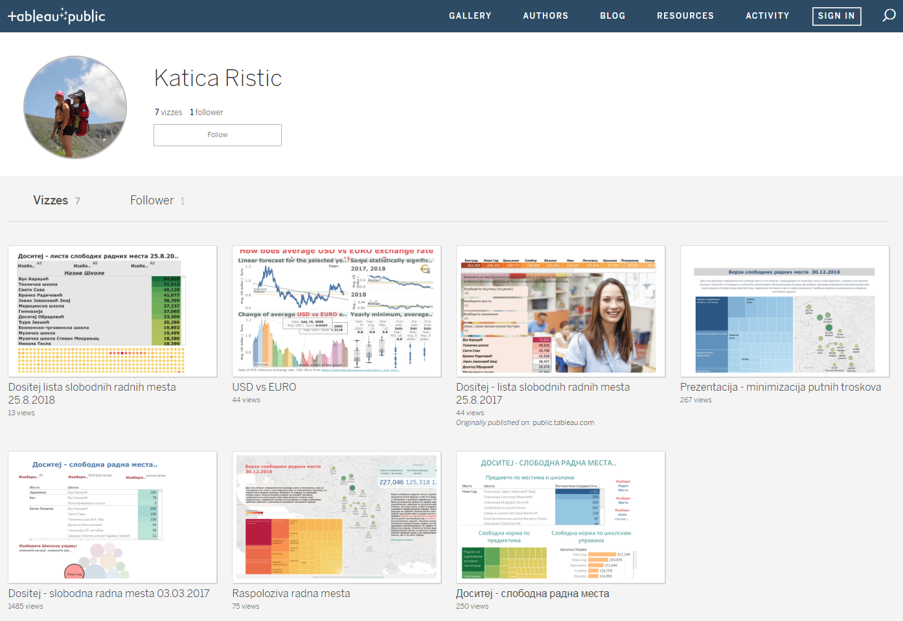
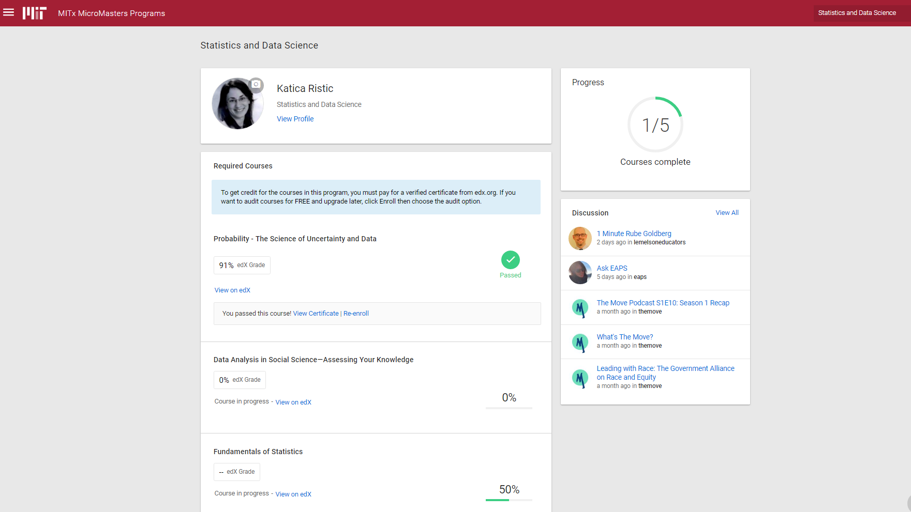

class: inverse, middle

background-image: url("logoWiDS.jpg")
background-position:top left
background-size: 12% 11%

#Discovery of:
- ##** Data Science**
- ##** MIT - MicroMaster Statistics and Data Science**

---
class: inverse, center, middle

background-image: url("logoWiDS.jpg")
background-position:top left
background-size: 12% 11%

#At the beginning: "Tabula rasa" 

---
class: inverse, center, middle

background-image: url("logoWiDS.jpg")
background-position:top left
background-size: 12% 11%


#What next**???**

---
class: inverse, center, middle

background-image: url("logoWiDS.jpg")
background-position:top left
background-size: 12% 11%

#Learning on upwork
```{r, out.width = "600px", out.height = '30%', echo=FALSE, fig.align = 'center'}

```

---
class: inverse,  center, middle


background-image: url("logoWiDS.jpg")
background-position:top left
background-size: 12% 11%

#Brought value to Excel knowledge 

.pull-left[

]

.pull-right[

]


---
class: inverse,  center, middle

background-image: url("logoWiDS.jpg")
background-position:top left
background-size: 12% 11%

#Excel file in Education: 63000 schools

```{r, out.width = "550px", out.height = '25%', echo=FALSE, fig.align = 'center'}

```

---
class: inverse,  center, middle

background-image: url("logoWiDS.jpg")
background-position:top left
background-size: 12% 11%

#Rafaela Guberoviæ - Data Scientist for Google


```{r, out.width = "500px", out.height = '30%', echo=FALSE, fig.align = 'center'}

```

---
class: inverse, middle

background-image: url("logoWiDS.jpg")
background-position:top left
background-size: 12% 11%

#Learning:
- ##R 
- ##Python
- ##SQL

---
class: inverse, middle

background-image: url("logoWiDS.jpg")
background-position:top left
background-size: 12% 11%

#MIT MicroMaster in Statictics and Data Science

- ##Equivalent to one semester on campus
- ##Intensive courses 12-16 weeks, 10-15 hours a week
- ##Instructor paced
- ##Detail understanding required
- ##Learning by making mistakes and by discovery


---
class: inverse,  top

background-image: url("logoWiDS.jpg")
background-position:top left
background-size: 12% 11%

Mystical World of Data Science        
25 April 2019, Subotica

#MIT MicroMaster in SDS profil

```{r, out.width = "700px", out.height = '30%', echo=FALSE, fig.align = 'center'}

```


