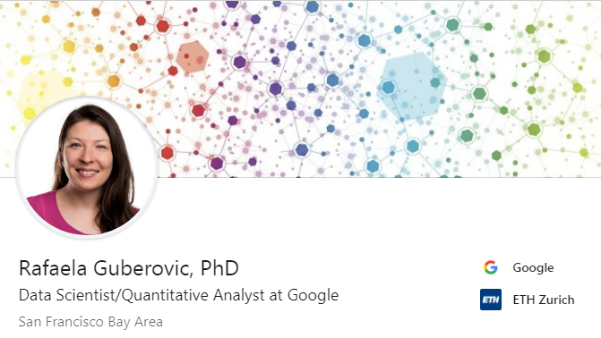

class: inverse, middle

background-image: url("DataScienceSerbia.png")
background-position:top left
background-size: 12% 11%

#Discovery of:
- ##** Data Science**
- ##** MIT - MicroMaster Statistics and Data Science**
- ##** Further initiative**

---
class: inverse, center, middle

background-image: url("DataScienceSerbia.png")
background-position:top left
background-size: 12% 11%

#At the beginning: "Tabula rasa" 

---
class: inverse, center, middle

background-image: url("DataScienceSerbia.png")
background-position:top left
background-size: 12% 11%


#What next**???**

---
class: inverse, center, middle

background-image: url("DataScienceSerbia.png")
background-position:top left
background-size: 12% 11%

#Learning on upwork
```{r, out.width = "600px", out.height = '30%', echo=FALSE, fig.align = 'center'}

```

---
class: inverse,  center, middle


background-image: url("DataScienceSerbia.png")
background-position:top left
background-size: 12% 11%

#Brought value to Excel knowledge 

.pull-left[

]

.pull-right[

]


---
class: inverse,  center, middle

background-image: url("DataScienceSerbia.png")
background-position:top left
background-size: 12% 11%

#Excel file in Education: 63000 schools

```{r, out.width = "550px", out.height = '25%', echo=FALSE, fig.align = 'center'}

```

---
class: inverse,  center, middle

background-image: url("DataScienceSerbia.png")
background-position:top left
background-size: 12% 11%

#Rafaela Guberovic - Data Scientist for Google


```{r, out.width = "500px", out.height = '30%', echo=FALSE, fig.align = 'center'}

```

---
class: inverse, middle

background-image: url("DataScienceSerbia.png")
background-position:top left
background-size: 12% 11%

#Learning:


.pull-left[
- ##R
- ##Python
- ##SQL]

.pull-right[

      
     
]

---
class: inverse, middle

background-image: url("MITstat1.jpg")
background-position:top left
background-size: 100% 100%

#MIT MicroMaster in Statictics and Data Science

- ##Equivalent to one semester on campus
- ##Intensive courses 12-16 weeks, 10-15 hours a week
- ##Instructor paced
- ##Detail understanding required
- ##Learning by discovery and making mistakes 


---
class: inverse,  center, top

background-image: url("DataScienceSerbia.png")
background-position:top left
background-size: 12% 11%


#MIT MicroMaster in SDS profil

```{r, out.width = "700px", out.height = '30%', echo=FALSE, fig.align = 'center'}

```

---
class: inverse, middle

background-image: url("MIT1.png")
background-position:top left
background-size: 100% 100%

#MIT MicroMaster in SDS - 5 courses to pass:

- ##Probability - The Science of Uncertainty and Data
- ##Data Analysis in Social Science - Assessing Your Knowledge
- ##Fundamentals of Statistics
- ##Machine Learning with Python: from Linear Models to Deep Learning 
- ##Capstone Exam in Statistics and Data Science

---
class: inverse, center, middle

background-image: url("DataScienceSerbia.png")
background-position:top left
background-size: 12% 11%

#MIT MicroMaster in SDS - progress board


```{r, out.width = "700px", out.height = '100%', echo=FALSE, fig.align = 'center'}

```


---
class: inverse, middle

background-image: url("MIT4.jpg")
background-position:top left
background-size: 100% 100%

#Bringing MIT to you

- ##No entrance Exam
- ##Strong mathematical and programming skills
- ##Open book exams
- ##Proactive exam at the end 
- ##Companies and universities recognise MIT MicroMasters 

---
class: inverse, center, middle

#Further initiative

```{r, out.width = "400px", out.height = '10%', echo=FALSE, fig.align = 'center'}

```

---
class: inverse, left, middle

background-image: url("DataScienceSerbia.png")
background-position:top left
background-size: 12% 11%


- ##86.67% ispitanika su zene
- ##11 godina ispitanici u proseku putuju i putovace jos 24 godine
- ##80.00% ispitanika zaposleno je na neodredeno
- ##93.33% zeli da rade u mestu u kome zive
- ##3.13 je prosecna procena ispitanika, na skali od 1 do 10, o mogucnosti promene njihove trenutne situacije

---
class: inverse, left, middle

background-image: url("DataScienceSerbia.png")
background-position:top left
background-size: 12% 11%


- ##70.00% je zaposleno u osnovnim skolama, 28.33% u srednjoskolskom obrazovanju, dok 1.67% se izjasnio kao nesto drugo
- ##ukupno 5648 km/dnevno, prosecno 95.7 km/dnevno po osobi
- ##ukupno 7885 minuta/dnevno, prosecno 133.6 minuta/dnevno po osobi 
- ##ukupno 47070 dinara/dnevno, prosecno 797.8 dinara/dnevno po osobi


---
class: inverse, middle

background-image: url("DataScienceSerbia.png")
background-position:top left
background-size: 12% 11%

#Useful Links

- #[Flyers about the programs](https://github.com/KaticaR/Learning-about-DATA/tree/master/WiDS%20conference/MITFlyers)
- #[MIT MicroMasters on EdX](https://www.edx.org/micromasters/mitx-statistics-and-data-science)
- #[MIT MicroMasters on MIT](https://micromasters.mit.edu/ds/)
- #[Dusan Milosevic - Data Science kursevi preko interneta (2019)](https://dusanmilosevic.com/data-science-kursevi-preko-interneta/)
- #[Petition](https://www.change.org/p/%C5%A1kolska-uprava-novi-sad-pokrenimo-ministarstvo-prosvete-da-re%C5%A1i-problem-putnika)
- #[R-Ladies Novi Sad](https://www.meetup.com/rladies-novi-sad/)

 
---
class: inverse, center, middle

background-image: url("DataScienceSerbia.png")
background-position:top left
background-size: 12% 11%

#Great thanks for listening :) 
##Questions